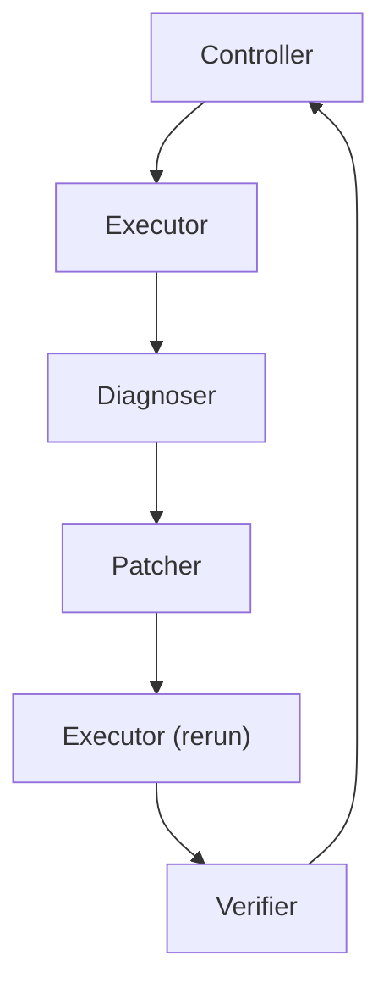

# Architecture Overview

TraceFix uses a narrow orchestration architecture so that each step in the debugging process is inspectable, bounded, and easy to justify in a Track A course project.

## System Goal

The system helps a beginner-to-intermediate Python user debug one small script at a time. It is intentionally designed to:

- gather execution evidence first
- localize the likely cause before editing
- generate only small, auditable patch attempts
- verify whether a patch should actually be accepted
- stop or escalate when evidence is too weak

## Component Roles

### Controller

Role:

- owns session state
- drives the end-to-end workflow
- enforces bounded retries
- persists artifacts and summaries

Inputs:

- script path
- optional expected output
- retry budget
- optional test hints

Outputs:

- final session state
- per-session trace and summary artifacts
- final decision: `accept`, `retry`, `escalate`, or `stop`

### Executor

Role:

- runs the current code in bounded local Python execution
- produces structured evidence rather than diagnosis

Inputs:

- current code
- session metadata
- execution config
- optional expected output and simple test hints

Outputs:

- `ExecutionResult`
- execution trace events

### Diagnoser

Role:

- interprets execution evidence
- localizes likely cause
- proposes a bounded repair direction

Inputs:

- current code
- latest `ExecutionResult`
- optional user intent
- optional expected output
- prior patch history
- prior verifier feedback

Outputs:

- `DiagnoserResult`

### Patcher

Role:

- turns a diagnosis into the smallest reasonable code edit
- refuses when a safe localized edit is not justified

Inputs:

- current code
- diagnosis result
- prior patch history
- verifier feedback

Outputs:

- `PatcherResult`

### Verifier

Role:

- compares original and rerun behavior
- decides whether the latest patch should be accepted, retried, escalated, or stopped

Inputs:

- original code
- patched code
- original execution result
- rerun execution result
- diagnosis result
- patch result
- expected output when available
- retry count and retry budget

Outputs:

- `VerifierResult`

## Handoffs

The main control flow is:

Each handoff is written to `trace.jsonl` as an inspectable event:

- `controller -> executor`
- `executor -> diagnoser`
- `diagnoser -> patcher`
- `patcher -> executor`
- `executor -> verifier`
- `verifier -> controller`

This matters for the course rubric because the system is not just a list of components. It shows real coordination and real transitions between roles.

## Tools, Memory, Data, and State Design

### Tools

TraceFix uses a deliberately small toolset:

- bounded Python subprocess execution
- temporary working directories
- structured JSONL trace logging
- Markdown and CSV artifact generation

It does not use:

- internet access
- package installation
- arbitrary shell workflows
- multi-file repository tools

### Memory / State

The primary memory object is the controller session state. It stores:

- session id
- target file
- retry budget
- original execution result
- attempt history
- intermediate patch paths
- final decision
- behavior match status
- pointers to saved artifacts

This state is persisted to `session_state.json` so the run can be inspected after the fact.

### Data Artifacts

For each session, TraceFix saves:

- `trace.jsonl`
- `session_state.json`
- `summary.md`
- `failure_summary.md` when unresolved
- intermediate patch candidates and diffs
- accepted final patch when available

For evaluation, TraceFix also saves:

- `evaluation_results.csv`
- `failure_cases.csv`
- `run_summary.md`

### Why This Design Fits the Scope

This design is course-appropriate because it is:

- reproducible
- easy to inspect manually
- easy to cite in a report
- narrow enough to stay feasible

## Stopping Conditions

TraceFix stops under these conditions:

- initial execution already succeeds and behavior is acceptable
- patch is accepted by the verifier
- patcher refuses because evidence is too weak
- verifier escalates because behavior cannot be trusted automatically
- verifier stops because retry budget is exhausted

These stopping conditions are important because they show governance. The system is allowed to stop instead of pretending certainty.

## Why This Is Better Than a One-Shot Baseline

A one-shot baseline might ask a model to read code and directly propose a fix. That is simpler, but it is much harder to audit:

- no explicit execution evidence
- no separation between diagnosis and patching
- no independent verification step
- no bounded retry policy
- no inspectable handoff trace
- no explicit state object tying the run together

TraceFix is better for this course project because reviewers can see:

- what evidence was collected
- what hypothesis was formed
- what patch was attempted
- what happened on rerun
- why the final decision was accept, retry, escalate, or stop
