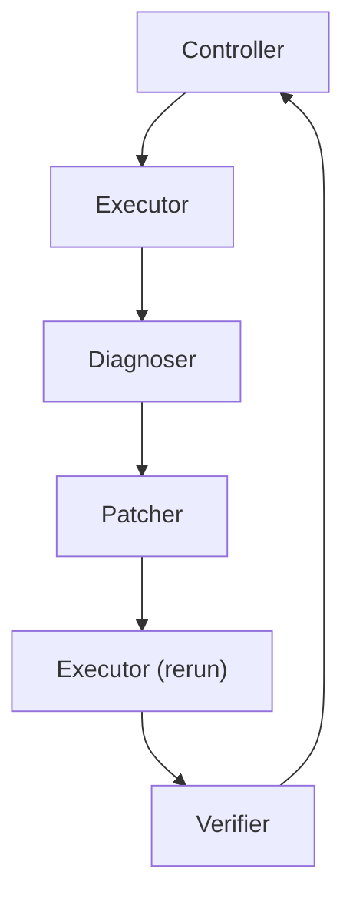

# Architecture Overview

TraceFix uses a narrow orchestration architecture so that each step in the debugging process is inspectable and bounded.

## Components

### Controller

Role:

- owns session state
- drives the end-to-end workflow
- enforces bounded retries
- persists artifacts and summaries

Inputs:

- current script path
- optional expected output
- retry budget

Outputs:

- final session state
- per-session artifacts
- final decision and summary

### Executor

Role:

- runs the current code in bounded local Python execution
- returns structured execution evidence

Inputs:

- current code
- optional expected output
- session metadata
- execution config

Outputs:

- `ExecutionResult`
- trace events for execution start and end

### Diagnoser

Role:

- interprets execution evidence
- localizes likely cause
- provides a bounded repair direction

Inputs:

- current code
- latest execution result
- optional user intent
- optional expected output
- prior patch history
- prior verifier feedback

Outputs:

- `DiagnoserResult`

### Patcher

Role:

- turns a diagnosis into the smallest reasonable code edit
- refuses when a safe localized patch is not justified

Inputs:

- current code
- diagnosis result
- prior patch history
- verifier feedback

Outputs:

- `PatcherResult`

### Verifier

Role:

- compares original and rerun behavior
- checks whether the fix should be accepted, retried, escalated, or stopped

Inputs:

- original code
- patched code
- original execution result
- rerun execution result
- diagnosis result
- patch result
- expected output when available
- retry count and retry budget

Outputs:

- `VerifierResult`

## Handoffs

The main control flow is:

Each handoff is written to `trace.jsonl` as an inspectable event:

- `controller -> executor`
- `executor -> diagnoser`
- `diagnoser -> patcher`
- `patcher -> executor`
- `executor -> verifier`
- `verifier -> controller`

## Stopping Conditions

TraceFix stops under these conditions:

- initial execution already succeeds and behavior is acceptable
- patch is accepted by the verifier
- patcher refuses because evidence is too weak
- verifier escalates because behavior cannot be trusted automatically
- verifier stops because retry budget is exhausted

## Why This Is Better Than a One-Shot Baseline

A one-shot baseline might ask a model to read code and directly propose a fix. That is simpler, but it is much harder to audit:

- no explicit execution evidence
- no separation between diagnosis and patching
- no independent verification step
- no bounded retry policy
- no inspectable handoff trace

TraceFix is better for this course project because it makes the agentic structure visible. Reviewers can see what evidence was collected, what hypothesis was formed, what patch was attempted, and why the final decision was accept, retry, escalate, or stop.
